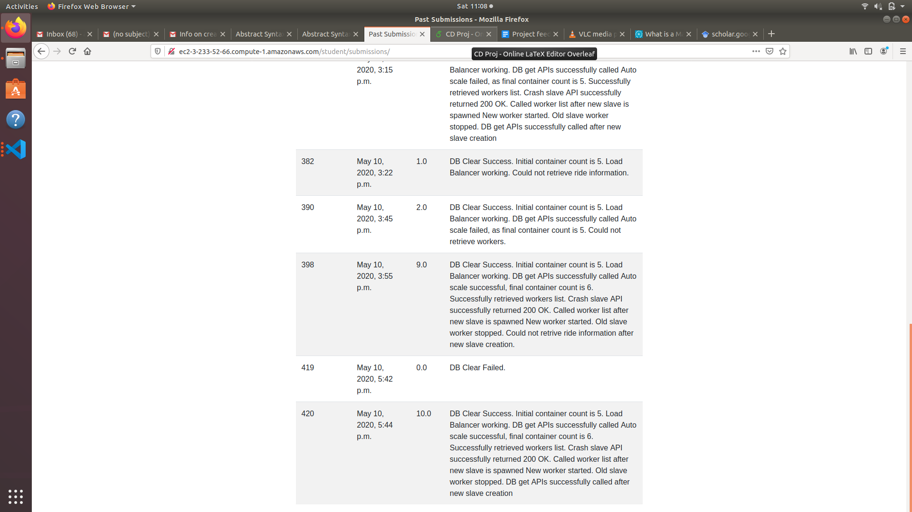

# Project

## Documentation

### Project directory:
* this folder has all the code that was developed for the final project.
* the master.py file has all the code that performs write action on the Data Base. It is connected to the orchastrator using a RabbitMQ connection.
* the slave.py file has all the code that perfroms the read action on the data base. It is connected to the orcastrator using many RabbitMQ connections.
* this folder desnt contain the code used for the non DB apis. (They are imported from the other dirctories)

## TO Run (DBaaS):
* Clone the repository.
* make sure all the requirments are met.
* open the code and edit all the ip addresses if needed. Also change the update rate and sync rate if needed.
* start the orchastrator and make its ip visible
* connect to DBaaS when a Database operation is needed. 
* Modify the code if constomized DB is needed.

## Testing

* All original APIs work well on localhost
* Scale up and Scale down feature works
* All is done

## Result:

